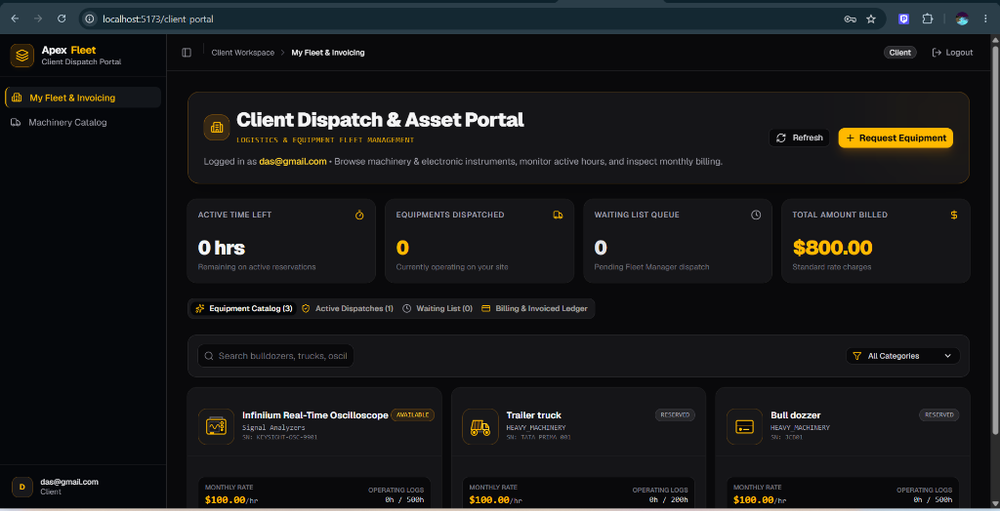
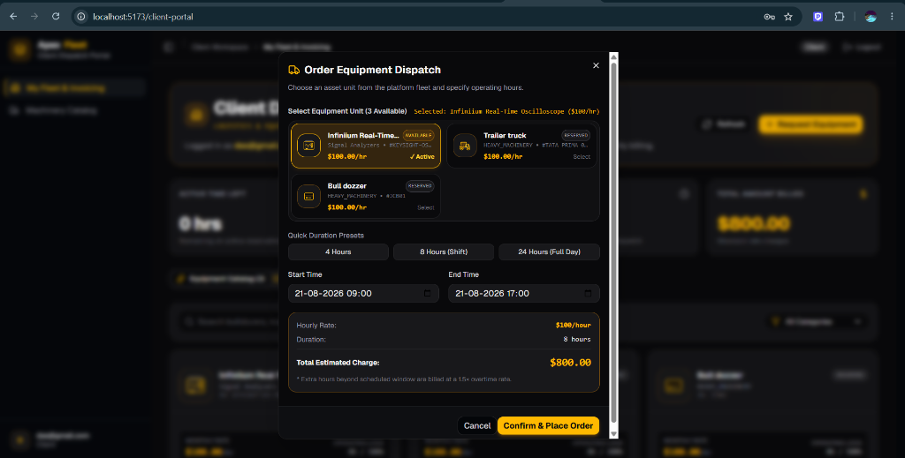
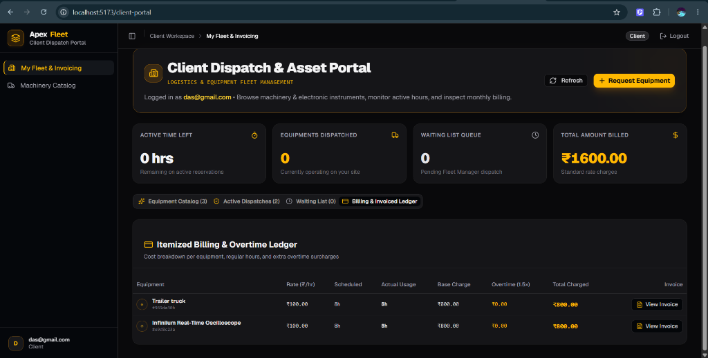
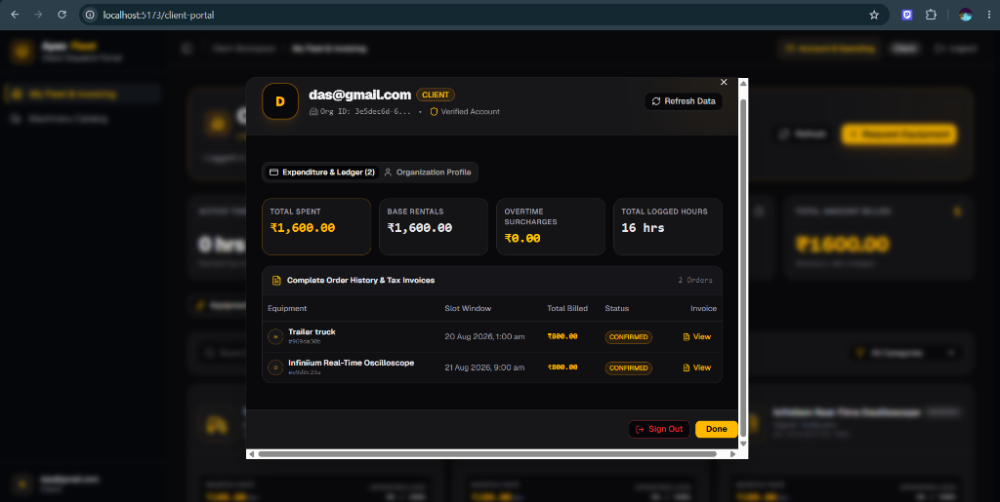
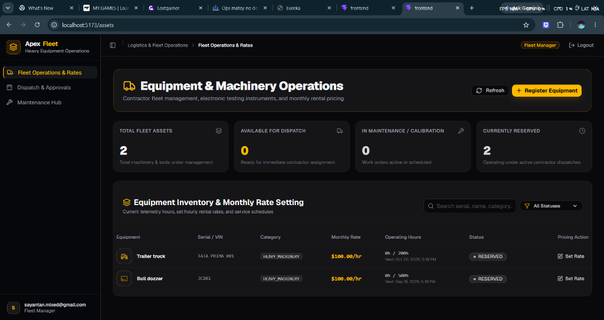
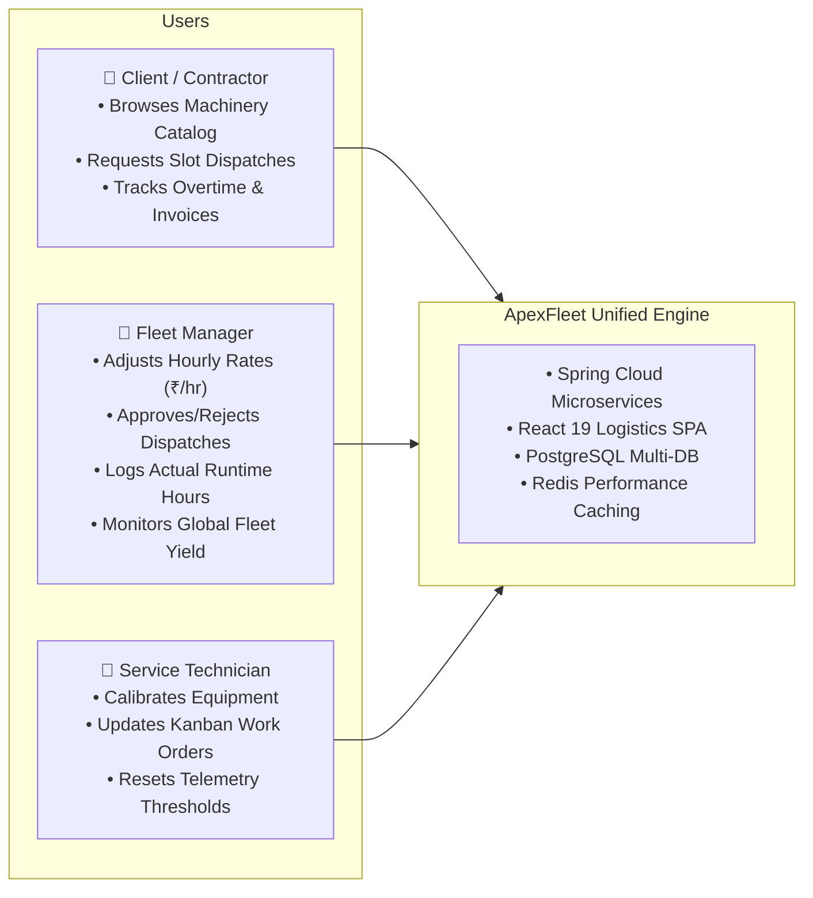
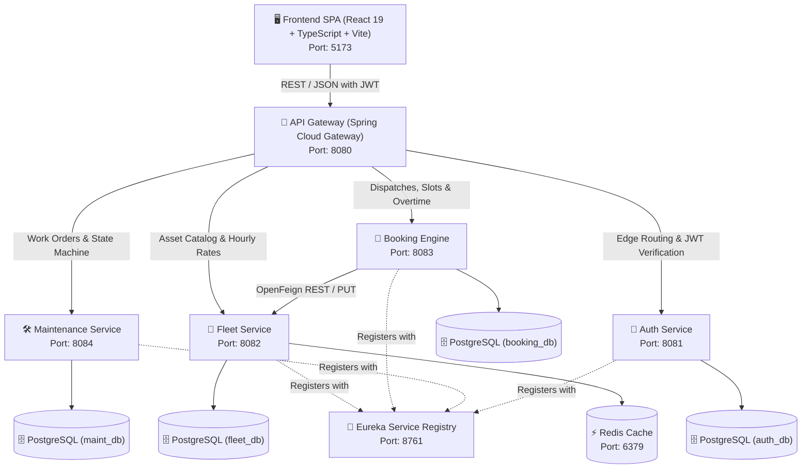
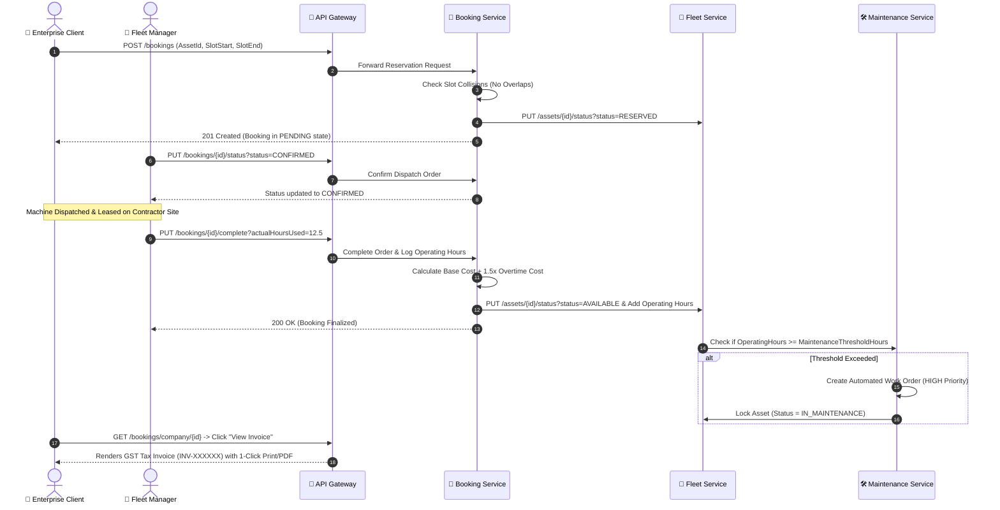

# 🚜 ApexFleet — Industrial Asset Dispatch & Predictive Maintenance Platform

[](https://spring.io/projects/spring-boot)
[](https://spring.io/projects/spring-cloud)
[](https://react.dev/)
[](https://www.typescriptlang.org/)
[](https://vitejs.dev/)
[](https://tailwindcss.com/)
[](https://www.postgresql.org/)
[](https://redis.io/)
[](https://www.docker.com/)

**ApexFleet** is an enterprise-grade, distributed B2B platform designed for the commercial leasing, real-time dispatching, and automated predictive maintenance of high-value industrial machinery, contractor assets, and precision instrumentation.

Built on a decoupled microservices architecture with a responsive industrial-themed SPA, ApexFleet bridges the operational divide between **Fleet Managers**, **Enterprise Contractors / Clients**, and **Field Service Technicians**.

---

## 📑 Table of Contents

1. [Application Screenshots & UI Showcase](#-application-screenshots--ui-showcase)
2. [Executive Summary & Problem Statement](#-executive-summary--problem-statement)
3. [The ApexFleet Solution & Key Beneficiaries](#-the-apexfleet-solution--key-beneficiaries)
4. [System Architecture & Microservice Ecosystem](#-system-architecture--microservice-ecosystem)
5. [Core Features & Functional Modules](#-core-features--functional-modules)
6. [End-to-End Business Flow & Logic](#-end-to-end-business-flow--logic)
7. [Design System & Vector Illustration Library](#-design-system--vector-illustration-library)
8. [GST Invoicing & Indian Rupee Economy](#-gst-invoicing--indian-rupee-economy)
9. [Repository Directory Structure](#-repository-directory-structure)
10. [Prerequisites & Quick Start Guide](#-prerequisites--quick-start-guide)
11. [REST API Endpoint Reference](#-rest-api-endpoint-reference)
12. [Security, RBAC & Multi-Tenancy](#-security-rbac--multi-tenancy)
13. [Future Roadmap & Extensibility](#-future-roadmap--extensibility)

---

## 📸 Application Screenshots & UI Showcase

### 1. Contractor Dispatch & Asset Portal
The primary contractor workspace featuring real-time fleet telemetry, active time indicators, machinery catalog with custom vector icons (Oscilloscopes, Trailer Trucks, Bulldozers), and instant equipment requesting.

<p align="center">
  
</p>

---

### 2. Interactive Equipment Dispatch & Live Rate Estimator Modal
Contractors select specific machinery units, pick quick duration presets (4 hrs, 8 hrs shift, 24 hrs full day), specify slot windows, and receive live total charge calculations with 1.5× overtime disclosures.

<p align="center">
  
</p>

---

### 3. Itemized Billing & Overtime Ledger
Detailed financial audit ledger displaying equipment units, rates ($\text{₹/hr}$), scheduled vs. actual runtime telemetry hours, base rental charges, 1.5× overtime penalty surcharges, total charged amounts, and one-click GST Tax Invoice access.

<p align="center">
  
</p>

---

### 4. Client Account & Lifetime Spending Center
The dedicated client account center modal providing total lifetime spending metrics in Indian Rupees ($\text{INR ₹}$), base rental vs. overtime surcharge breakdowns, total operating hours logged, and direct invoice inspection.

<p align="center">
  
</p>

---

### 5. Fleet Manager Equipment Operations & Inventory Rate Setting
The fleet manager command center showing total platform fleet assets, availability metrics, active contractor dispatches, operating telemetry vs. service thresholds, and direct hourly rate controls ($\text{₹/hr}$).

<p align="center">
  
</p>

---

## 🎯 Executive Summary & Problem Statement

### The Industrial Machinery Dilemma

Modern civil, electrical, mechanical, and infrastructural contractors frequently rely on leased heavy machinery and precision test instruments (e.g., excavators, mobile cranes, haul trucks, oscilloscopes, calibration stations). However, legacy equipment leasing operations suffer from critical systemic inefficiencies:

| Problem Area | Operational Impact | ApexFleet Resolution |
| :--- | :--- | :--- |
| **Double-Booking & Schedule Collisions** | Manual spreadsheets and phone dispatches cause simultaneous equipment reservations, resulting in idle crew standoffs and costly project delays. | **Database-level pessimistic read locking & slot overlap validation algorithms** guarantee conflict-free dispatching. |
| **Unmonitored Telemetry & Breakdown Surprises** | Machines are run past their manufacturer-recommended service hours without warnings, triggering catastrophic on-site failures and project shutdowns. | **Continuous runtime hour telemetry tracking with automated threshold triggers** automatically generates preventative work orders. |
| **Opaque Overtime & Disputes** | Clients frequently overrun scheduled windows without transparent telemetry tracking, sparking billing disputes. | **Automated 1.5× overtime surcharge engine** calculated dynamically upon usage logging. |
| **Disconnected Financial Invoicing** | Quotes, rate cards, and invoices are handled across fragmented tools without real-time tax breakdowns. | **Native GST Tax Invoice Generation Engine with 1-click A4 PDF / Print export** and itemized rate breakdowns in Indian Rupees ($\text{INR ₹}$). |
| **Lack of Operational Visibility** | Fleet Managers lack executive insights into equipment yield, availability ratios, and fleet health. | **Real-time executive metrics dashboard and role-tailored account centers** for both fleet managers and contractors. |

---

## 🌟 The ApexFleet Solution & Key Beneficiaries

ApexFleet unifies equipment dispatching, pricing control, condition-based maintenance, and commercial billing into a single real-time platform:



### Beneficiary Breakdown:
1. **Fleet Managers**: Maximizes asset uptime, sets dynamic hourly rates ($\text{₹/hr}$), audits client usage, eliminates billing leakage with automated overtime surcharges, and prevents equipment degradation.
2. **Contractors & Clients**: Transparent access to high-value machinery catalogs, instant slot validation, live cost estimation, and instant access to downloadable GST Tax Invoices.
3. **Maintenance Crews**: Automated, deterministic work-order lifecycle (`CREATED` $\rightarrow$ `ASSIGNED` $\rightarrow$ `IN_PROGRESS` $\rightarrow$ `COMPLETED`) prioritizing machinery nearing calibration or maintenance due dates.

---

## 🏗️ System Architecture & Microservice Ecosystem

ApexFleet is architected using the **Database-per-Service** pattern, orchestrated with **Spring Cloud Netflix Eureka** for dynamic service registration and discovery, and routed via a high-throughput **Spring Cloud API Gateway**.



### Microservice Specifications:

| Service Name | Port | Primary Responsibilities | Key Technologies |
| :--- | :---: | :--- | :--- |
| **`api-gateway`** | `8080` | Central ingress, reverse proxy, JWT edge validation, CORS headers, route discovery. | Spring Cloud Gateway, Reactive Netty |
| **`eureka-server`** | `8761` | Dynamic service discovery, heartbeat tracking, and cluster load balancing. | Spring Cloud Netflix Eureka |
| **`auth-service`** | `8081` | Multi-tenant organization registration, user authentication, BCrypt password hashing, JWT token issuance. | Spring Security 6, JJWT, Hibernate |
| **`fleet-service`** | `8082` | Heavy machinery & tool inventory, rental rate management ($\text{₹/hr}$), runtime hour logging, category indexing, and status transitions (`AVAILABLE`, `RESERVED`, `IN_MAINTENANCE`, `DECOMMISSIONED`). | Spring Data JPA, Redis Cache, PostgreSQL |
| **`booking-service`** | `8083` | Concurrency-safe dispatch reservation engine, time slot collision checking, approval workflows, actual runtime recording, and automated 1.5× overtime billing. | Spring Data JPA, OpenFeign, PostgreSQL |
| **`maintenance-service`** | `8084` | Predictive maintenance scheduler, automated work-order generation upon threshold breach, Kanban task transitions, technician assignment. | Spring Data JPA, Scheduled Tasks, PostgreSQL |

---

## ⚡ Core Features & Functional Modules

### 1. 🚜 Dynamic Equipment Catalog & Custom Symbols
- **Category Presets**: Heavy Construction (Bulldozers, Haul Trucks, Mobile Cranes, Excavators, Concrete Mixers), Precision Electronics & Testing (Oscilloscopes, Digital Multimeters, Spectrum Analyzers), Industrial Logistics (Heavy Forklifts, Diesel Generators, Surveying Stations, Welding Systems).
- **Custom Vector Graphics**: Dedicated SVG illustration library rendering clean, modern equipment symbols instead of generic placeholders.
- **Hourly Pricing Controls**: Fleet Managers can dynamically update hourly rental prices ($\text{₹/hr}$) with instant propagation across active quotes.

### 2. ⏱️ Concurrency-Safe Dispatching & Overtime Engine
- **Slot Collision Detection**: Prevents scheduling overlap on the same equipment unit:
  $$\text{Overlap} \iff (\text{RequestedStart} < \text{ExistingEnd}) \land (\text{RequestedEnd} > \text{ExistingStart})$$
- **Live Price Estimation**: Real-time duration and cost calculation before order placement.
- **1.5× Overtime Penalty Surcharge**:
  $$\text{Base Cost} = \text{Scheduled Hours} \times \text{Base Rate}$$
  $$\text{Overtime Cost} = \max(0, \text{Actual Hours} - \text{Scheduled Hours}) \times (1.5 \times \text{Base Rate})$$
  $$\text{Total Invoice Amount} = \text{Base Cost} + \text{Overtime Cost}$$

### 3. 🧾 Native GST Tax Invoicing System
- **Tax Breakdown**: Automatically computes **CGST (9%)** and **SGST (9%)** over taxable subtotal.
- **Enterprise Standards**: Includes corporate GSTIN, CIN, unique reference (`INV-XXXXXX`), billing party identifiers, equipment serials, and payment terms.
- **Print & PDF Engine**: Formatted with clean print CSS rules for instant one-click A4 PDF export and physical printing.

### 4. 🛠️ Predictive Maintenance & Work Order State Machine
- **Telemetry Threshold Triggering**: When an asset's `operatingHours` exceeds its `maintenanceThresholdHours`, an automated preventative work order is scheduled.
- **Kanban Board**: Drag-and-drop or status-driven pipeline (`CREATED` $\rightarrow$ `ASSIGNED` $\rightarrow$ `IN_PROGRESS` $\rightarrow$ `COMPLETED`).
- **Safety Lockout**: Equipment under active maintenance is locked out of contractor reservation pipelines until certified and closed by a technician.

### 5. 👤 Comprehensive Account & Executive Analytics Center
- **For Contractors**: Lifetime expenditure summary, base vs. overtime charges, total operating hours logged, and direct access to all past tax invoices.
- **For Fleet Managers**: Gross fleet revenue, overtime revenue collected, available vs. reserved fleet tally, active work order status, and global activity audit stream.

---

## 🔄 End-to-End Business Flow & Logic



---

## 🎨 Design System & Vector Illustration Library

ApexFleet features an **Industrial Safety-Yellow and Charcoal-Grey** visual identity inspired by international heavy equipment, logistics yards, and calibration laboratories.

### Color Palette (Tailwind CSS 4 / OKLCH)

```
Primary Amber/Yellow : oklch(0.82 0.18 85)   /* #FBBF24 - Safety Yellow */
Primary Foreground   : oklch(0.12 0.01 260)  /* #18181B - Charcoal Dark */
Dark Background      : oklch(0.12 0.01 260)  /* #09090B - Deep Zinc */
Card & Panel Glass   : oklch(0.16 0.01 260)  /* #18181B - Card Surface */
Border Accent        : oklch(0.25 0.02 260)  /* Zinc-800 Edge */
```

### Supported Equipment Vector Symbols (`<EquipmentIcon />`):
- 🚜 **Heavy Earthmoving**: Bulldozer, Excavator, Haul Truck, Concrete Mixer.
- 🏗️ **Lifting & Logistics**: Mobile Crane, Heavy Industrial Forklift.
- ⚡ **Electrical & RF Test Instrumentation**: Digital Oscilloscope, Precision Multimeter / Ohmmeter, Spectrum Analyzer.
- 💻 **Field Engineering & Surveying**: High-Performance Mobile Workstation, Laser Surveying Station, Arc Welding Unit, Diesel Generator.

---

## 🇮🇳 GST Invoicing & Indian Rupee Economy

All pricing, ledger entries, and enterprise registration tiers are standardized on the **Indian Rupee ($\text{INR ₹}$)**:

### B2B Enterprise Subscription Tiers:
- **Basic Contractor Tier**: $\text{₹4,999 / month}$
- **Standard Logistics Tier**: $\text{₹14,999 / month}$
- **Enterprise Fleet Tier**: $\text{₹39,999 / month}$

### Sample Invoice Calculation:
| Item | Scheduled | Actual Logged | Rate | Total (INR) |
| :--- | :---: | :---: | :---: | :---: |
| CAT D8T Bulldozer Rental | 8.0 hrs | 8.0 hrs | ₹1,500.00/hr | ₹12,000.00 |
| Overtime Operating Surcharge | — | 2.5 hrs | ₹2,250.00/hr (1.5×) | ₹5,625.00 |
| **Taxable Subtotal** | | | | **₹17,625.00** |
| Central GST (CGST @ 9%) | | | | ₹1,586.25 |
| State GST (SGST @ 9%) | | | | ₹1,586.25 |
| **Grand Total Due** | | | | **₹20,797.50** |

---

## 📂 Repository Directory Structure

```
Asset-Dispatch-Predictive-Maintenance-Platform/
├── api-gateway/                      # Spring Cloud Gateway (8080)
│   └── src/main/resources/application.yml
├── eureka-server/                    # Netflix Eureka Discovery (8761)
│   └── src/main/resources/application.yml
├── auth-service/                     # Identity & Multi-tenant RBAC (8081)
│   └── src/main/java/com/enterprise/auth_service/
├── fleet-service/                    # Equipment Catalog & Rates (8082)
│   └── src/main/java/com/enterprise/fleet/
├── booking-service/                  # Dispatch & Overtime Engine (8083)
│   └── src/main/java/com/enterprise/booking/
├── maintenance-service/              # Predictive Maintenance & Kanban (8084)
│   └── src/main/java/com/enterprise/maintenance/
├── frontend/                         # React 19 + TypeScript + Vite SPA (5173)
│   ├── src/
│   │   ├── api/                      # Axios configured API client
│   │   ├── components/
│   │   │   ├── account/              # Account Details & Analytics Modal
│   │   │   ├── icons/                # Equipment Vector Illustration Library
│   │   │   ├── invoice/              # GST Tax Invoice Dialog & Print Engine
│   │   │   ├── layout/               # Sidebar Layout, Breadcrumbs & Header
│   │   │   └── ui/                   # Shadcn UI Design System Primitives
│   │   ├── context/                  # AuthContext (JWT & Role Management)
│   │   ├── pages/
│   │   │   ├── ClientDashboard.tsx   # Contractor Portal & Invoicing Ledger
│   │   │   ├── FleetCatalog.tsx      # Equipment Catalog & Rate Setting
│   │   │   ├── BookingEngine.tsx     # Dispatch Approvals & Actual Usage
│   │   │   ├── MaintenanceHub.tsx    # Predictive Kanban Work Orders
│   │   │   ├── Login.tsx             # Enterprise Authentication
│   │   │   └── Register.tsx          # Multi-Tenant Registration (INR Tiers)
│   │   └── types/                    # Shared TypeScript Type Definitions
│   ├── package.json
│   └── vite.config.ts
├── docker-compose.yml                # Multi-container orchestration
└── README.md                         # Comprehensive documentation
```

---

## 🚀 Prerequisites & Quick Start Guide

### System Prerequisites
- **Java**: JDK 17 or higher
- **Node.js**: Node 20.x or 22.x with npm
- **Docker & Docker Compose**: Installed and running
- **Git**: Installed

---

### Step 1: Start Infrastructure Containers

Launch the PostgreSQL multi-database instances and Redis cache:

```bash
docker compose up -d
```

Verify containers are healthy:
- **PostgreSQL**: `localhost:5432` (Databases: `auth_db`, `fleet_db`, `booking_db`, `maint_db`)
- **Redis**: `localhost:6379`

---

### Step 2: Boot Microservices in Sequence

Open separate terminal windows or use your IDE runner to start services in the following order:

1. **Service Registry (Eureka)**:
   ```bash
   cd eureka-server/eureka-server
   ./mvnw spring-boot:run
   ```
   *Dashboard available at:* `http://localhost:8761`

2. **API Gateway**:
   ```bash
   cd api-gateway/api-gateway
   ./mvnw spring-boot:run
   ```
   *Gateway Ingress at:* `http://localhost:8080`

3. **Auth Service**:
   ```bash
   cd auth-service/auth-service
   ./mvnw spring-boot:run
   ```

4. **Fleet Service**:
   ```bash
   cd fleet-service/fleet-service
   ./mvnw spring-boot:run
   ```

5. **Booking Service**:
   ```bash
   cd booking-service/booking-service
   ./mvnw spring-boot:run
   ```

6. **Maintenance Service**:
   ```bash
   cd maintenance-service/maintenance-service
   ./mvnw spring-boot:run
   ```

---

### Step 3: Launch the Frontend Application

```bash
cd frontend
npm install
npm run dev
```

The application will be live at: **`http://localhost:5173`**

---

## 📡 REST API Endpoint Reference

All endpoints are accessed via the API Gateway at `http://localhost:8080/api/v1/...`

### 1. Authentication & Multi-Tenancy (`/api/v1/auth`)
| Method | Endpoint | Description | Auth Required |
| :--- | :--- | :--- | :---: |
| `POST` | `/auth/register` | Register new organization & user with selected INR billing tier. | No |
| `POST` | `/auth/login` | Authenticate credentials and receive signed JWT token. | No |

### 2. Fleet & Machinery Management (`/api/v1/assets`)
| Method | Endpoint | Description | Auth Required |
| :--- | :--- | :--- | :---: |
| `GET` | `/assets` | Retrieve all platform fleet machinery and test tools. | Yes |
| `POST` | `/assets` | Register a new equipment unit with serial, threshold, and hourly rate. | Yes (Manager) |
| `GET` | `/assets/{id}` | Get specific asset telemetry, operating hours, and status. | Yes |
| `PATCH` | `/assets/{id}/price?hourlyRate={rate}` | Adjust the hourly rental rate ($\text{₹/hr}$). | Yes (Manager) |
| `PUT` | `/assets/{id}/status?status={status}` | Update asset status (`AVAILABLE`, `RESERVED`, `IN_MAINTENANCE`). | Yes |

### 3. Dispatch & Overtime Booking Engine (`/api/v1/bookings`)
| Method | Endpoint | Description | Auth Required |
| :--- | :--- | :--- | :---: |
| `POST` | `/bookings` | Place a new equipment dispatch reservation with slot start/end. | Yes |
| `GET` | `/bookings` | Retrieve all platform booking dispatches across organizations. | Yes (Manager) |
| `GET` | `/bookings/company/{companyId}` | Retrieve all booking records for a specific contractor organization. | Yes |
| `PUT` | `/bookings/{id}/status?status={status}` | Approve (`CONFIRMED`) or Reject (`REJECTED`) a dispatch request. | Yes (Manager) |
| `PUT` | `/bookings/{id}/complete?actualHoursUsed={hrs}` | Record actual usage, trigger 1.5× overtime math, and finalize billing. | Yes (Manager) |

### 4. Predictive Maintenance & Work Orders (`/api/v1/work-orders`)
| Method | Endpoint | Description | Auth Required |
| :--- | :--- | :--- | :---: |
| `GET` | `/work-orders` | Retrieve all active and completed maintenance tickets. | Yes |
| `POST` | `/work-orders` | Manually schedule a maintenance or calibration work order. | Yes |
| `PATCH` | `/work-orders/{id}/state?state={state}` | Transition work order along Kanban (`ASSIGNED`, `IN_PROGRESS`, `COMPLETED`). | Yes (Tech/Manager) |

---

## 🔒 Security, RBAC & Multi-Tenancy

ApexFleet implements an enterprise role-based access control (RBAC) model:

- **`ROLE_CLIENT`**: Contractor tenant access. Can browse the catalog, submit dispatch requests, monitor live usage, view company expenditure, and download formal GST Tax Invoices.
- **`ROLE_FLEET_MANAGER`**: Fleet owner access. Full control over asset registration, pricing configuration ($\text{₹/hr}$), dispatch approvals, runtime logging, and global revenue analytics.
- **`ROLE_TECHNICIAN`**: Maintenance personnel access. Dedicated Kanban workspace to inspect machinery telemetry, conduct calibrations, and complete work orders.

JWT tokens are digitally signed with HMAC-SHA256, carrying user IDs, company UUIDs, and granted authorities across all microservice boundaries.

---

## 🔮 Future Roadmap & Extensibility

- [ ] **Payment Gateway Integration**: Direct settlement via Razorpay / UPI for instant invoice payment.
- [ ] **Real-Time IoT Telemetry Simulation**: WebSocket-driven continuous sensor stream (vibration, engine heat, RPM) for real-time wear prediction.
- [ ] **AI-Powered Predictive Failure Analysis**: Machine learning model forecasting remaining useful life (RUL) based on operational load profiles.
- [ ] **GPS Fleet Geofencing**: Live geolocation map tracking active dispatches on site boundaries.

---

## 📄 License & Credits

ApexFleet is developed as an enterprise-grade Asset Dispatch & Predictive Maintenance showcase platform.
Licensed under the [MIT License](LICENSE).